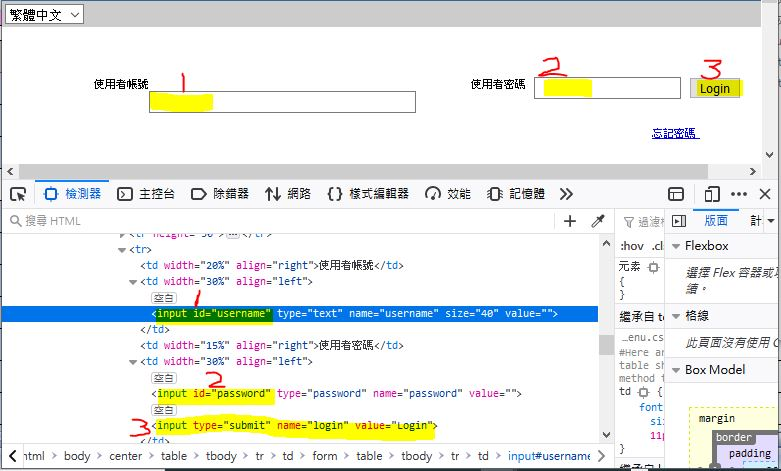

# click_webpage_login_without_input_id_is
VBA and C#, code snippet, both work for the same webpage.

the wepage and login button, what does looks like

  


### VBA code
```vba
sub click_login_button_without_input_id ()

 Set MyBrowser = objShell.Run("""C:\Program Files (x86)\Google\Chrome\Application\Chrome.exe""")
 Set HTMLDoc = MyBrowser.document
      With HTMLDoc
        Set elems = .getElementsByTagName("input")
        For Each e In elems
            If (e.getAttribute("type") = "submit") Then
                e.click
                Exit For
            End If
            Next e
    End With
    Do Until MyBrowser.readyState = READYSTATE_COMPLETE
        DoEvents
    Loop
    End If
    
    Err_Clear:
    If Err <> 0 Then
       Err.Clear
       Resume Next
    End If
 
job_done:
 
    caller = ""
    Set MyBrowser = Nothing
    Set HTMLDoc = Nothing

end sub

```


### C# code
```csharp
private  void btnTest_click_login_button_without_input_id(object sender, EventArgs e)
{
     System.Windows.Forms.HtmlDocument doc = webBrowser1.Document;

    try
    {
        HtmlElement username = doc.GetElementById(txtBUserElementID.Text);
        HtmlElement password = doc.GetElementById(txtBPassElementID.Text);
        HtmlElement submit = doc.GetElementById(txtBLoginElementID.Text);

        if (!checkBoxjustButtonClick.Checked)
        {

            username.SetAttribute("value", txtBUsername.Text);
            password.SetAttribute("value", txtBPassword.Text);

        }


        string title = webBrowser1.Document.Title;
        
        listBox1.Items.Add(title);
        
        string description = String.Empty;

        foreach (HtmlElement meta in webBrowser1.Document.GetElementsByTagName("META"))
        {
            if (meta.Name.ToLower() == "input") //"description")
            {
                description = meta.GetAttribute("content");
                listBox1.Items.Add(description);
            }
        }

        foreach (HtmlElement he in webBrowser1.Document.All.GetElementsByName("textfield2"))
        {
            //he.SetAttribute("value", TextBox1.Text);
        }

        
        
        
        
        // Webpage with login button but no <input id> for click, uses this method
        // 1, loop and find every TagName of "input"
        // 2, check the "type" of each Tag
        // 3, if "submit", click this Tag to as mouse click to login button.
         
        foreach (HtmlElement elem in webBrowser1.Document.GetElementsByTagName("input"))
        {
            String my = elem.GetAttribute("type");
            listBox1.Items.Add(my);              // debug
            //if (elem.GetAttribute("type") == "submit")
            if (my == "submit")
            {
             //   listBox1.Items.Add(my);
                elem.InvokeMember("click"); // once found the HTML Element, click it to login
                break;                      // exit the foreach loop
            }
            //listBox1.Items.Add(elem.ToString());
        }


     
        //submit.InvokeMember("click");
        //elem.InvokeMember("click");

    }
    catch (Exception )
    {
        listBoxErrors.Items.Add(DateTime.Now.ToLongTimeString() + "     " + "ERROR Could Not Send command to web page !!");
       // MessageBox.Show(ex.Message, "m3");
        //throw;
    }

}   
```
